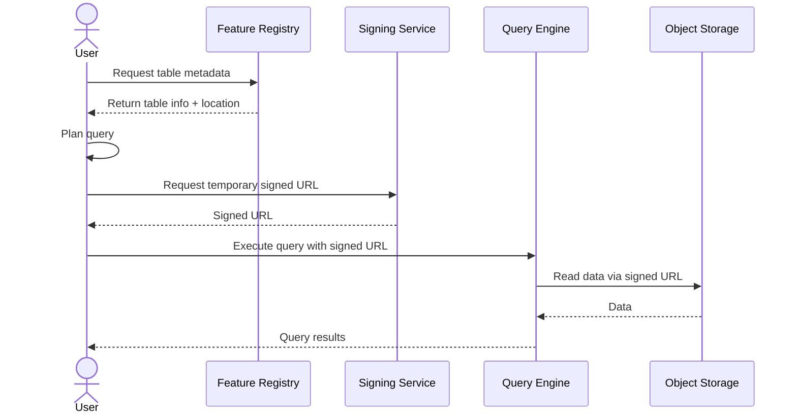

# Connectomics Feature Registry

This service provides a **metadata registry** for large, externally stored feature tables and embeddings (Parquet, Delta Lake, Iceberg, Lance, etc.) generated from connectomics data. It is built on top of **DataHub** and is designed to support **petabyte-scale, materialization-version-based scientific data** without moving or duplicating data.

The primary audience is **data scientists** who publish, discover, and interpret connectomics feature data at scale.

The registry is intentionally **descriptive, not authoritative**: it records what exists, how it was produced, and how it relates to other data—but it does not own the bytes, enforce access, or execute queries.

---

## Core Philosophy

### 1. Data is immutable; meaning evolves
Feature tables are treated as **immutable artifacts**. If something changes, a **new version is published**. Nothing is overwritten or silently updated.

This preserves:
- Reproducibility
- Trust
- Long-term debuggability

---

### 2. Materialization versions are the clock
All feature artifacts are generated **against explicit materialization versions** of upstream systems (segmentation, annotations, etc.).

There is no attempt to make large feature tables “live” with respect to ongoing edits. Instead, we make materialization version alignment **explicit and queryable**.

---

### 3. Storage is not ownership
The registry **never copies data**.

- Tables live in object storage (GCS, S3, etc.)
- Query engines (Polars, DuckDB, Spark, Ray) read data directly
- The registry stores *metadata only*

---

### 4. Facts, not enforcement
The registry stores **signals**, not decisions.

For example:
- Expected spatial drift
- Materialization version compatibility
- Intended join semantics

Whether a dataset is “valid” for a particular use case is left to **downstream tooling and users**, not hard-coded rules.

---

### 5. One explicit publish step
Nothing appears in the registry automatically.

Publishing a dataset is a **deliberate, explicit action** that:
- Declares intent
- Assigns ownership
- Freezes semantics

This avoids ghost datasets and accidental production dependencies.

---

## What the Registry Is (and Is Not)

### The registry **is**
- A system of record for dataset *meaning*
- A discovery and coordination layer
- A place to encode domain-specific semantics
- A bridge between feature tables and annotations

### The registry **is not**
- A query engine
- A data lake
- An access proxy
- A workflow scheduler

---

## Access Flow (Mermaid)

---

## Conceptual Model

The registry models a small set of core concepts.

### Dataset (logical)
A **human-facing concept** that users talk about:
> “Synapse embeddings”

A dataset may have many versions over time.

---

### DatasetVersion (physical artifact)
A **specific, immutable table** produced by a computation:
- Stored in object storage
- Has a concrete format (Delta, Iceberg, etc.)
- Generated against a specific materialization version

This is what users actually read.

---

### Materialization Version
A named, immutable state of an upstream system:
- Segmentation release
- Annotation release

Dataset versions always reference the materialization version they were generated against.

---

### Columns
Columns carry **semantic meaning**, not just types:
- Annotation IDs
- Spatial coordinates
- Embeddings

This enables intentional joins and safer downstream use.

---

### References
References describe **intended relationships**:
- Which column joins to which annotation type
- Cardinality and stability assumptions

These are *declarative*, not enforced.

---

## Supported Table Formats

The registry is **format-agnostic**.

Supported formats include:
- Parquet (small or ad hoc tables)
- Delta Lake
- Iceberg (recommended for large batch tables)
- Lance (embedding-focused storage)

Format differences are recorded as **metadata**, not encoded into dataset identity.

---

## Publishing a Dataset

Publishing registers metadata only.

A typical publish flow:
1. A data scientist generates a table in object storage
2. They run a single `publish` command or API call
3. The registry records:
   - Location
   - Format
   - Schema
   - Materialization version alignment
   - Ownership
   - Semantic metadata

No data is copied or scanned beyond lightweight metadata inspection.

---

## Access and Security

The registry does **not** manage access directly.

Instead:
- A separate signing service issues time-limited signed URLs
- Authorization is enforced at signing time
- Users read data directly from object storage

This keeps the registry simple, scalable, and cloud-agnostic.

---

## Why DataHub

DataHub is used as the underlying metadata platform because it provides:
- A graph-based metadata model
- First-class support for versioning and lineage
- Extensible custom metadata (“aspects”)
- Proven scalability for heterogeneous data

The registry uses DataHub as a **truth registry**, not a gatekeeper.

---

## Design Non-Goals

The following are explicitly out of scope:
- Automatic inference of “data correctness”
- Live synchronization with segmentation edits
- Enforcing semantic constraints at read time
- Abstracting over query engines

These concerns are handled by downstream systems.

---# Connectomics Feature Registry

This service provides a **metadata registry** for large, externally stored feature tables and embeddings (Parquet, Delta Lake, Iceberg, Lance, etc.) generated from connectomics data. It is built on top of **DataHub** and is designed to support **petabyte-scale, snapshot-based scientific data** without moving or duplicating data.

The registry is intentionally **descriptive, not authoritative**: it records what exists, how it was produced, and how it relates to other data—but it does not own the bytes, enforce access, or execute queries.

---

## Core Philosophy

### 1. Data is immutable; meaning evolves
Feature tables and embeddings are treated as **immutable artifacts**. If something changes, a **new version is published**. Nothing is overwritten or silently updated.

This preserves:
- Reproducibility
- Trust
- Long-term debuggability

---

### 2. Snapshots are the clock
All feature artifacts are generated **against explicit snapshots** of upstream systems (segmentation, annotations, etc.).

There is no attempt to make large feature tables “live” with respect to ongoing edits. Instead, we make snapshot alignment **explicit and queryable**.

---

### 3. Storage is not ownership
The registry **never copies data**.

- Tables live in object storage (GCS, S3, etc.)
- Query engines (Polars, DuckDB, Spark, Ray) read data directly
- The registry stores *metadata only*

---

### 4. Facts, not enforcement
The registry stores **signals**, not decisions.

For example:
- Expected spatial drift
- Snapshot compatibility
- Intended join semantics

Whether a dataset is “valid” for a particular use case is left to **downstream tooling and users**, not hard-coded rules.

---

### 5. One explicit publish step
Nothing appears in the registry automatically.

Publishing a dataset is a **deliberate, explicit action** that:
- Declares intent
- Assigns ownership
- Freezes semantics

This avoids ghost datasets and accidental production dependencies.

---

## What the Registry Is (and Is Not)

### The registry **is**
- A system of record for dataset *meaning*
- A discovery and coordination layer
- A place to encode domain-specific semantics
- A bridge between feature tables and annotations

### The registry **is not**
- A query engine
- A data lake
- An access proxy
- A workflow scheduler

---

## Conceptual Model

The registry models a small set of core concepts.

### Dataset (logical)
A **human-facing concept** that users talk about:
> “Synapse embeddings”

A dataset may have many versions over time.

---

### DatasetVersion (physical artifact)
A **specific, immutable table** produced by a computation:
- Stored in object storage
- Has a concrete format (Delta, Iceberg, etc.)
- Generated against a specific snapshot

This is what users actually read.

---

### Snapshot
A named, immutable state of an upstream system:
- Segmentation release
- Annotation release

Dataset versions always reference the snapshot they were generated against.

---

### Columns
Columns carry **semantic meaning**, not just types:
- Annotation IDs
- Spatial coordinates
- Embeddings

This enables intentional joins and safer downstream use.

---

### References
References describe **intended relationships**:
- Which column joins to which annotation type
- Cardinality and stability assumptions

These are *declarative*, not enforced.

---

## Supported Table Formats

The registry is **format-agnostic**.

Supported formats include:
- Parquet (small or ad hoc tables)
- Delta Lake
- Iceberg (recommended for large batch tables)
- Lance (embedding-focused storage)

Format differences are recorded as **metadata**, not encoded into dataset identity.

---

## Publishing a Dataset

Publishing registers metadata only.

A typical publish flow:
1. A data scientist generates a table in object storage
2. They run a single `publish` command or API call
3. The registry records:
   - Location
   - Format
   - Schema
   - Snapshot alignment
   - Ownership
   - Semantic metadata

No data is copied or scanned beyond lightweight metadata inspection.

---

## Access and Security

The registry does **not** manage access directly.

Instead:
- A separate signing service issues time-limited signed URLs
- Authorization is enforced at signing time
- Users read data directly from object storage

This keeps the registry simple, scalable, and cloud-agnostic.

---

## Why DataHub

DataHub is used as the underlying metadata platform because it provides:
- A graph-based metadata model
- First-class support for versioning and lineage
- Extensible custom metadata (“aspects”)
- Proven scalability for heterogeneous data

The registry uses DataHub as a **truth registry**, not a gatekeeper.

---

## Design Non-Goals

The following are explicitly out of scope:
- Automatic inference of “data correctness”
- Live synchronization with segmentation edits
- Enforcing semantic constraints at read time
- Abstracting over query engines

These concerns are handled by downstream systems.

---

## Guiding Principle

> **Storage holds bytes.  
> Metadata holds truth.  
> Truth must survive time, people, and changing infrastructure.**

This registry exists to make large-scale connectomics feature data
**discoverable, interpretable, and reusable**—without slowing down science.

## Guiding Principle

> **Storage holds bytes.  
> Metadata holds truth.  
> Truth must survive time, people, and changing infrastructure.**

This registry exists to make large-scale connectomics feature data
**discoverable, interpretable, and reusable**—without slowing down science.
