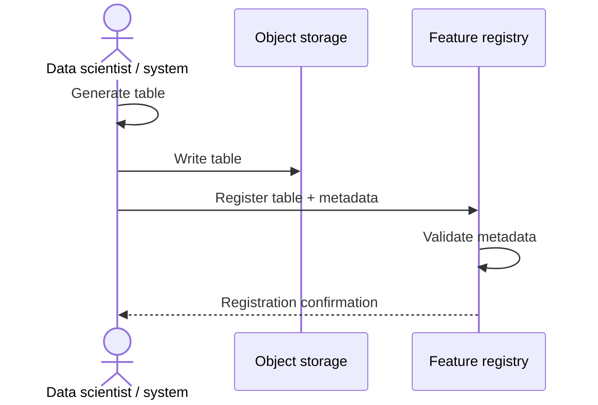
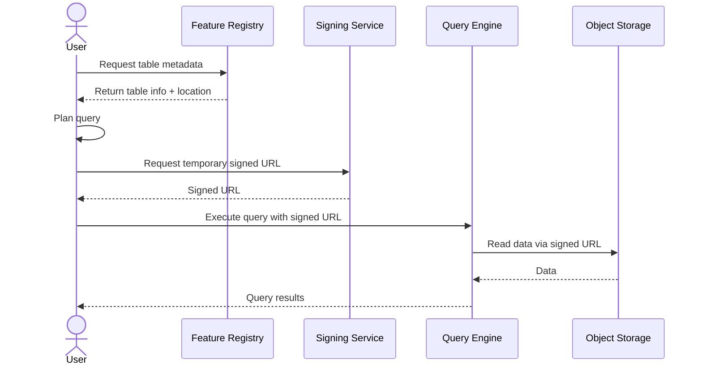
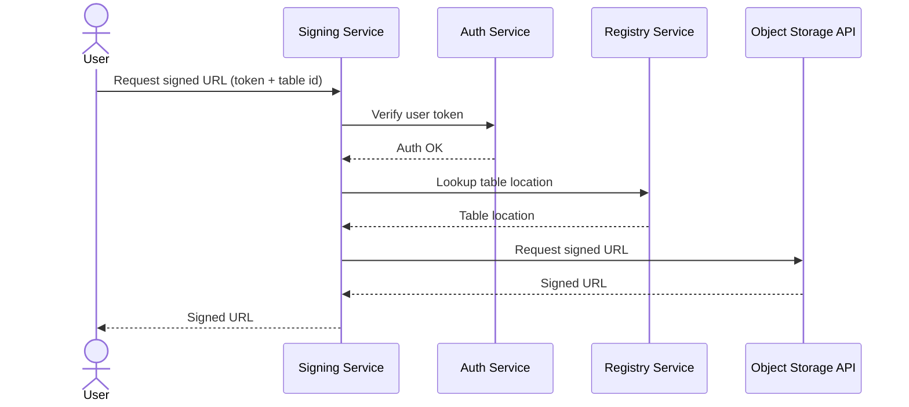
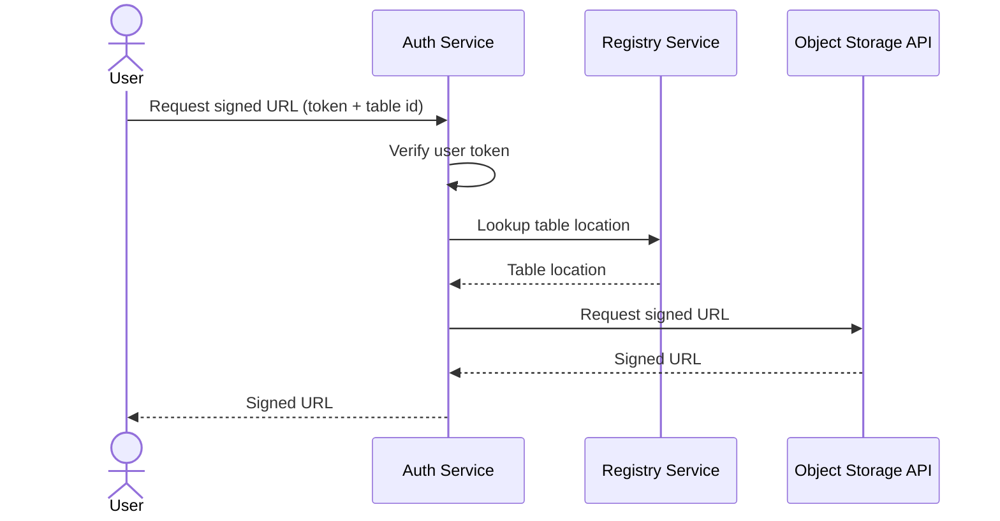
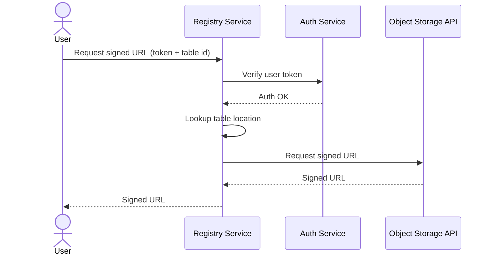

# Connectomics Feature Registry/Catalog (proposal)

This service provides a **metadata registry** for large, externally stored feature tables and embeddings (Parquet, Delta Lake, Iceberg, Lance, etc.) generated from connectomics data. It is designed to support **petabyte-scale, materialization-version-based connectomics data** without moving or duplicating data.

The primary audience is **data scientists** who publish, discover, and interpret connectomics feature data at scale.

The registry is intentionally **descriptive, not authoritative**: it records what exists, how it was produced, and how it relates to other data—but it does not own the bytes, enforce access, or execute queries.

- [Connectomics Feature Registry/Catalog (proposal)](#connectomics-feature-registrycatalog-proposal)
  - [Core Philosophy](#core-philosophy)
    - [Registration is not ownership](#registration-is-not-ownership)
    - [Facts, not enforcement](#facts-not-enforcement)
    - [One explicit publish step](#one-explicit-publish-step)
    - [Materialization versions are the clock](#materialization-versions-are-the-clock)
  - [What the Registry Is (and Is Not)](#what-the-registry-is-and-is-not)
    - [The registry **is**](#the-registry-is)
    - [The registry **is not**](#the-registry-is-not)
  - [Example Workflows](#example-workflows)
    - [Register Flow](#register-flow)
    - [Access Flow (Mermaid)](#access-flow-mermaid)
  - [Guiding Principle](#guiding-principle)
  - [Scratch / Brainstorming](#scratch--brainstorming)
    - [Decision Points](#decision-points)
    - [Options for Service Delineations](#options-for-service-delineations)
      - [Option 1](#option-1)
      - [Option 2](#option-2)
      - [Option 3](#option-3)
  - [Future Extensions](#future-extensions)

## Core Philosophy

### Registration is not ownership

The registry **never copies data**.

- Tables live in object storage (GCS, S3, etc.)
- Query engines (Polars, DuckDB, Spark, Ray) read data directly
- The registry stores *metadata only*

### Facts, not enforcement

The registry stores **signals**, not decisions.

For example:
- Expected invalidation radius that may make rows stale with proofreading
- Materialization version compatibility
- Intended join semantics, including base annotation tables in the annotation/materialization engine to reference

Whether a dataset is “valid” for a particular use case is left to **downstream tooling and users**, not hard-coded rules.

### One explicit publish step

Nothing appears in the registry automatically.

Publishing a dataset is a **deliberate, explicit action** that:
- Declares intent
- Assigns ownership
- Describes metadata

### Materialization versions are the clock

All feature artifacts are generated **against explicit materialization versions** of upstream systems (segmentation, annotations, etc.).

There is currently no attempt to make large feature tables “live” with respect to ongoing edits. Instead, we make materialization version alignment **explicit and queryable**.

## What the Registry Is (and Is Not)

### The registry **is**

- A system of record for dataset *meaning*
- A discovery and coordination layer
- A place to encode domain-specific semantics
- A bridge between feature tables and annotations

### The registry **is not**

- A query engine
- A data lake
- An access proxy (will not pass you any data)
- A workflow scheduler

## Example Workflows

### Register Flow

### Access Flow (Mermaid)

- Feature registry: this service
- Signing service: issues time-limited signed URLs. Unclear if this is part of auth, part of registry, or separate (see below under [Scratch / Brainstorming](#scratch--brainstorming)). 
- Query engine: Polars, DuckDB, etc.
- Object storage: GCS, S3, etc.

## Guiding Principle

> **Storage holds bytes.
> Metadata holds truth.  
> Truth must survive time, people, and changing infrastructure.**

This registry exists to make large-scale connectomics feature data
**discoverable, interpretable, and reusable**—without slowing down science.

## Scratch / Brainstorming

### Decision Points

- What to use as the underlying metadata platform?
  - DataHub
    - [Blog on the creation of DataHub](https://www.linkedin.com/blog/engineering/data-management/datahub-popular-metadata-architectures-explained)
  - OpenMetadata
    - [Blog on why to use OpenMetadata](https://blog.open-metadata.org/why-openmetadata-is-the-right-choice-for-you-59e329163cac) (I found it really jargony)
    - [Doc on main concepts in OpenMetadata](https://docs.open-metadata.org/latest/main-concepts/high-level-design?utm_source=google&utm_medium=paid-search&utm_campaign=omd-goog-amer-en-brand-aw&utm_adgroup=165976860866&utm_term=open%20metadata&utm_campaign=21627991159&utm_source=google&utm_medium=paid_search&hsa_acc=2097547741&hsa_cam=21627991159&hsa_grp=165976860866&hsa_ad=710804984805&hsa_src=g&hsa_tgt=kwd-903209659080&hsa_kw=open%20metadata&hsa_mt=e&hsa_net=adwords&hsa_ver=3&gad_source=1&gad_campaignid=21627991159&gbraid=0AAAAA9-MDDldmZedqY4SwsmfITe4iuQDB&gclid=Cj0KCQiA-YvMBhDtARIsAHZuUzLdz664JsOyzfaH_IrTSpA1XE3joAIBa9H-Sd8KJiqMWj3F9fK2dwIaAkB9EALw_wcB)
  - Amundsen
  - Unity CatalogvV
  - [Marquez](https://marquezproject.ai/about/)
  - Custom solution
- What metadata fields to use initially?
  - table name
  - description
  - location (URI)
  - format (e.g. Delta, Iceberg, Lance, Parquet)
  - schema (column names and types), optional text description of each column
  - datastack or aligned volume identifier
  - snapshot timestamp or time range
  - materialization version alignment
  - ownership (team, individual)
  - invalidation radius (in nm), optional
  - licensing or usage constraints
  - retention policy / TTL (if applicable)
  - citation (if applicable)
  - references to annotation tables and columns
  - other joinable semantic information, e.g. references to other tables
  - tags or categories
  - information about the version of the pipeline/model that produced the data
  - quality/validation metadata (e.g., checksum, row count, validation status)
  - status (draft, published, deprecated)
  - lineage (superseded by, derived from)
- What (if anything) to enforce vs just record as metadata?
  - make sure the table exists at the given location?
  - auto-detect schema from the data?
  - verify materialization version exists? what if it is not a long term release?
  - should the registry block publishing if materialization version is missing?
  - partition columns
- How to ensure to keep this compatible with future services which might involve worker systems which write data on some schedule or dynamically as features are updated (e.g. Dagster)?
- At what granularity to define access for users (really this is a concern of the signing service, but could be part of metadata?)?
- ChatGPT suggested "Feature tables are treated as **immutable artifacts**. If something changes, a **new version is published**. Nothing is overwritten or silently updated." This seems hard to enforce given what we've described otherwise so far.

### Options for Service Delineations

Currently, we have the `auth` service which handles user authentication and authorization. We are debating several options for how to divide responsibilities related to user authentication, creation of signed URLs, and table metadata lookup between the `auth` service, a potential new `signing` service, and the `registry` service.

All will assume the user already knows which table they want to access; exploring tables and planning queries is assumed to already be done (handled by the user querying the registry for metadata).

#### Option 1

Auth, signing, and registry are separate services.

#### Option 2

Auth handles signing; registry handles metadata.

#### Option 3

Everything handled by registry service (backed by auth).

## Future Extensions

- This enables a pathway for writing static dumps of tables (say, from old materialization version which we want to support but not keep in SQL) into object storage. The materialization engine could be triggered to write out the table to cloud storage and generate the appropriate metadata for the registry to register it.
    - Even for more modern versions of tables, this could still be a good idea, because it enables query engines to see and possibly join to these tables without needing to go through the materialization engine (slow).
- The enables a future where systems are generating features on a schedule or on the fly in the interim, and registering them automatically with the registry.

<!-- 
## Conceptual Model

The registry models a small set of core concepts.

### Dataset (logical)
A **human-facing concept** that users talk about:
> “Synapse embeddings”

A dataset may have many versions over time.

### DatasetVersion (physical artifact)

A **specific, immutable table** produced by a computation:
- Stored in object storage
- Has a concrete format (Delta, Iceberg, etc.)
- Generated against a specific materialization version

This is what users actually read.

### Materialization Version

A named, immutable state of an upstream system:
- Segmentation release
- Annotation release

Dataset versions always reference the materialization version they were generated against.

### Columns

Columns carry **semantic meaning**, not just types:
- Annotation IDs
- Spatial coordinates
- Embeddings

This enables intentional joins and safer downstream use.

### References

References describe **intended relationships**:
- Which column joins to which annotation type
- Cardinality and stability assumptions

These are *declarative*, not enforced.

## Supported Table Formats

The registry is **format-agnostic**.

Supported formats include:
- Parquet (small or ad hoc tables)
- Delta Lake
- Iceberg (recommended for large batch tables)
- Lance (embedding-focused storage)

Format differences are recorded as **metadata**, not encoded into dataset identity.

## Publishing a Dataset

Publishing registers metadata only.

A typical publish flow:
1. A data scientist generates a table in object storage
2. They run a single `publish` command or API call
3. The registry records:
   - Location
   - Format
   - Schema
   - Materialization version alignment
   - Ownership
   - Semantic metadata

No data is copied or scanned beyond lightweight metadata inspection.

## Access and Security

The registry does **not** manage access directly.

Instead:
- A separate signing service issues time-limited signed URLs
- Authorization is enforced at signing time
- Users read data directly from object storage

This keeps the registry simple, scalable, and cloud-agnostic.

## Why DataHub

DataHub is used as the underlying metadata platform because it provides:
- A graph-based metadata model
- First-class support for versioning and lineage
- Extensible custom metadata (“aspects”)
- Proven scalability for heterogeneous data

The registry uses DataHub as a **truth registry**, not a gatekeeper.
 -->