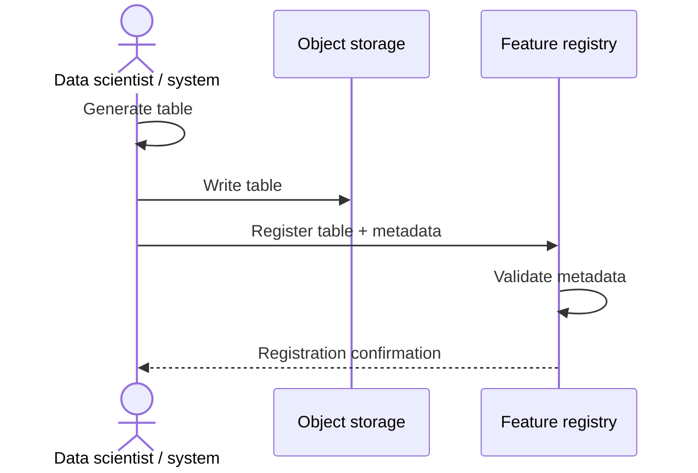
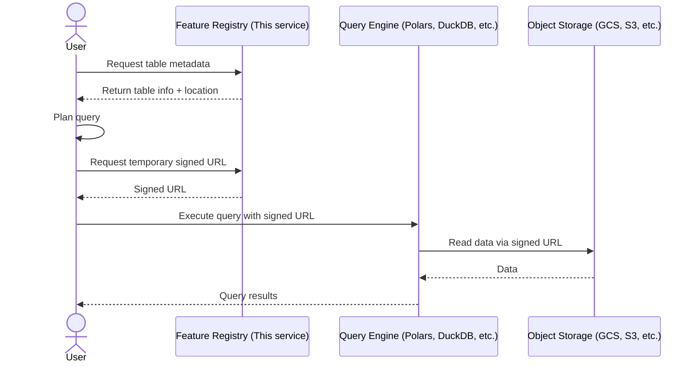

# Connectomics Feature Registry/Catalog (proposal) <!-- omit from toc -->

This service would provide a **metadata registry** for large, externally stored feature tables and embeddings (Parquet, Delta Lake, Iceberg, Lance, etc.) generated from connectomics data. It is designed to be a **lightweight, descriptive layer** that enables discovery, interpretation, and reuse of feature datasets without owning the data. It also aims to handle access so that users can easily retrieve data but access costs can be managed.

- [Use Cases](#use-cases)
  - [Bulk](#bulk)
  - [Data analyst](#data-analyst)
  - [Data scientist](#data-scientist)
- [Decision Points / Concerns / Brainstorming](#decision-points--concerns--brainstorming)
- [Example Workflows](#example-workflows)
  - [Register Flow](#register-flow)
  - [Access Flow](#access-flow)
- [Below this line is mainly an AI generated proposal (that I heavily edited) when I laid out the problems here](#below-this-line-is-mainly-an-ai-generated-proposal-that-i-heavily-edited-when-i-laid-out-the-problems-here)
- [Core Philosophy](#core-philosophy)
  - [Registration is not ownership](#registration-is-not-ownership)
  - [Facts, not enforcement](#facts-not-enforcement)
  - [One explicit publish step](#one-explicit-publish-step)
  - [Materialization versions are the clock](#materialization-versions-are-the-clock)
- [What the Registry Is (and Is Not)](#what-the-registry-is-and-is-not)
  - [The registry **is**](#the-registry-is)
  - [The registry **is not**](#the-registry-is-not)
- [Guiding Principle](#guiding-principle)

## Use Cases

*Potential* use cases for this registry include (we may drop some of these or add others as we refine the scope):

### Bulk

_Tasks along the lines of "just give me a large chunk of some data table"_

- Download the entire synapse table for a fixed materialization version for offline analysis

### Data analyst

_Tasks that involve gathering data into a clean table useful for exploration or making scientific plots, using information beyond what is currently supported in CAVE_

- Pull the synapse table for proofread axon cells, but with a extra columns showing distance from postsynaptic soma and bouton size, both of which were pre-computed and placed in feature tables for a fixed materialization version and registered in the registry
- Pull the raw soma-nucleus features for latest nuclei to make a plot of how nucleus folding varies between two cell types

### Data scientist

_Tasks that involve training models, deploying models, or doing computational search that might involve more complicated queries and joins_

- Pull SegCLR embeddings for presynaptic sites from proofread cells for training a model
- Query for SegCLR embeddings which are similar to a given synapse embedding (e.g. for searching for "synapses like me")
- Pull HKS features for pre- and post-synaptic sites for all synapses for a fixed materialization version
- Pull spine morphometry features for all spines that are within 500nm of the soma on excitatory cells

## Decision Points / Concerns / Brainstorming

- At what granularity to define access for users?
- Sven: long term, don't want the user to have to care about the source of the data. We might want a interface which looks a lot like the current one to materialization.
- Sven: may not want to support something as big as SegCLR for the initial version because it is so big
  - Ben: having a more queryable SegCLR (or similar) table is a large motivation for doing this for me
- This enables a pathway for writing static dumps of tables (say, from old materialization version which we want to support but not keep in SQL) into object storage. The materialization engine could be triggered to write out the table to cloud storage and generate the appropriate metadata for the registry to register it.
    - Even for more modern versions of tables, this could still be a good idea, because it enables query engines to see and possibly join to these tables without needing to go through the materialization engine (slow).
- What to use as the underlying metadata platform?
  - DataHub
    - [Blog on the creation of DataHub](https://www.linkedin.com/blog/engineering/data-management/datahub-popular-metadata-architectures-explained)
  - OpenMetadata
    - [Blog on why to use OpenMetadata](https://blog.open-metadata.org/why-openmetadata-is-the-right-choice-for-you-59e329163cac) (I found it really jargony)
    - [Doc on main concepts in OpenMetadata](https://docs.open-metadata.org/latest/main-concepts/high-level-design?utm_source=google&utm_medium=paid-search&utm_campaign=omd-goog-amer-en-brand-aw&utm_adgroup=165976860866&utm_term=open%20metadata&utm_campaign=21627991159&utm_source=google&utm_medium=paid_search&hsa_acc=2097547741&hsa_cam=21627991159&hsa_grp=165976860866&hsa_ad=710804984805&hsa_src=g&hsa_tgt=kwd-903209659080&hsa_kw=open%20metadata&hsa_mt=e&hsa_net=adwords&hsa_ver=3&gad_source=1&gad_campaignid=21627991159&gbraid=0AAAAA9-MDDldmZedqY4SwsmfITe4iuQDB&gclid=Cj0KCQiA-YvMBhDtARIsAHZuUzLdz664JsOyzfaH_IrTSpA1XE3joAIBa9H-Sd8KJiqMWj3F9fK2dwIaAkB9EALw_wcB)
  - Amundsen
  - Unity CatalogvV
  - [Marquez](https://marquezproject.ai/about/)
  - Custom solution
- What metadata fields to use initially?
  - table name
  - description
  - location (URI)
  - format (e.g. Delta, Iceberg, Lance, Parquet)
  - schema (column names and types), optional text description of each column
  - datastack or aligned volume identifier
  - snapshot timestamp or time range
  - materialization version alignment
  - ownership (team, individual)
  - invalidation radius (in nm), optional
  - licensing or usage constraints
  - retention policy / TTL (if applicable)
  - citation (if applicable)
  - references to annotation tables and columns
  - other joinable semantic information, e.g. references to other tables
  - tags or categories
  - information about the version of the pipeline/model that produced the data
  - quality/validation metadata (e.g., checksum, row count, validation status)
  - status (draft, published, deprecated)
  - lineage (superseded by, derived from)
  - partition columns
- What (if anything) to enforce vs just record as metadata?
  - make sure the table exists at the given location?
  - auto-detect schema from the data?
  - verify materialization version exists? what if it is not a long term release?
- How to ensure to keep this compatible with future services which might involve worker systems which write data on some schedule or dynamically as features are updated (e.g. Dagster)?
- ChatGPT suggested "Feature tables are treated as **immutable artifacts**. If something changes, a **new version is published**. Nothing is overwritten or silently updated." This seems hard to enforce given what we've described otherwise so far.

- The enables a future where systems are generating features on a schedule or on the fly in the interim, and registering them automatically with the registry.

## Example Workflows

### Register Flow

### Access Flow

## Below this line is mainly an AI generated proposal (that I heavily edited) when I laid out the problems here

---

## Core Philosophy

### Registration is not ownership

The registry **never copies data**.

- Tables live in object storage (GCS, S3, etc.)
- Query engines (Polars, DuckDB, Spark, Ray) read data directly
- The registry stores *metadata only*

### Facts, not enforcement

The registry stores **signals**, not decisions.

For example:
- Expected invalidation radius that may make rows stale with proofreading
- Materialization version compatibility
- Intended join semantics, including base annotation tables in the annotation/materialization engine to reference

Whether a dataset is “valid” for a particular use case is left to **downstream tooling and users**, not hard-coded rules.

### One explicit publish step

Nothing appears in the registry automatically.

Publishing a dataset is a **deliberate, explicit action** that:
- Declares intent
- Assigns ownership
- Describes metadata

### Materialization versions are the clock

All feature artifacts are generated **against explicit materialization versions** of upstream systems (segmentation, annotations, etc.).

There is currently no attempt to make large feature tables “live” with respect to ongoing edits. Instead, we make materialization version alignment **explicit and queryable**.

## What the Registry Is (and Is Not)

### The registry **is**

- A system of record for dataset *meaning*
- A discovery and coordination layer
- A place to encode domain-specific semantics
- A bridge between feature tables and annotations

### The registry **is not**

- A query engine
- A data lake
- An access proxy (will not pass you any data)
- A workflow scheduler

## Guiding Principle

> **Storage holds bytes.
> Metadata holds truth.  
> Truth must survive time, people, and changing infrastructure.**

This registry exists to make large-scale connectomics feature data
**discoverable, interpretable, and reusable**—without slowing down science.
